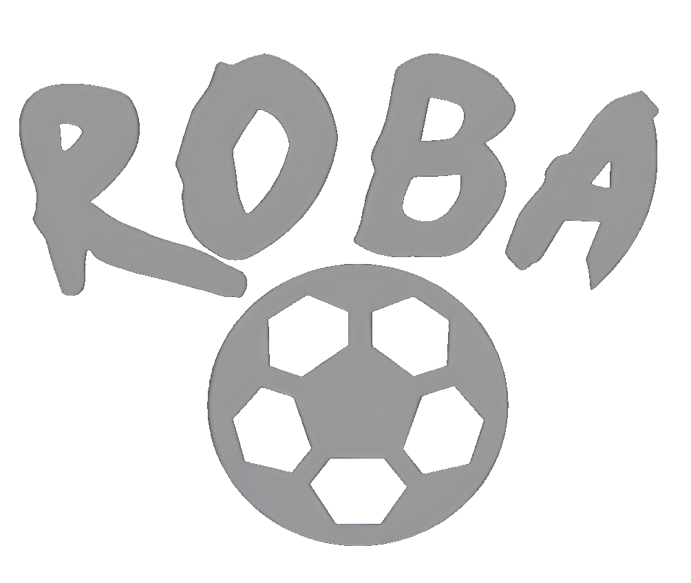

<!-- Improved compatibility of back to top link: See: https://github.com/othneildrew/Best-README-Template/pull/73 -->
<a id="readme-top"></a>
<!--
*** Thanks for checking out the Best-README-Template. If you have a suggestion
*** that would make this better, please fork the repo and create a pull request
*** or simply open an issue with the tag "enhancement".
*** Don't forget to give the project a star!
*** Thanks again! Now go create something AMAZING! :D
-->


<!-- PROJECT SHIELDS -->
<!--
*** I'm using markdown "reference style" links for readability.
*** Reference links are enclosed in brackets [ ] instead of parentheses ( ).
*** See the bottom of this document for the declaration of the reference variables
*** for contributors-url, forks-url, etc. This is an optional, concise syntax you may use.
*** https://www.markdownguide.org/basic-syntax/#reference-style-links
-->


<!-- PROJECT LOGO -->
<br />
<div align="center">
  <a href="https://github.com/othneildrew/Best-README-Template">
    
  </a>

  <h3 align="center">ROBA</h3>

  <p align="center">
    an original football game!
    <br />
    <a href="https://docs.google.com/document/d/1GKln2wASGXKx29XEX4jStX8-gqNn-gaeOCCDW9thXSs/edit?usp=sharing"><strong>Explore the docs »</strong></a>
    <br />
    <br />
    <a href="https://github.com/Edo816/roba">View Demo</a>
    ·
    <a href="https://github.com/Edo816/roba/issues/new?labels=bug&template=bug-report---.md">Report Bug</a>
    ·
    <a href="https://github.com/Edo816/roba/issues/new?labels=enhancement&template=feature-request---.md">Request Feature</a>
  </p>
</div>


<!-- TABLE OF CONTENTS -->
<details>
  <summary>Table of Contents</summary>
  <ol>
    <li>
      <a href="#about-the-project">About The Project</a>
      <ul>
        <li><a href="#built-with">Built With</a></li>
      </ul>
    </li>
    <li>
      <a href="#getting-started">Getting Started</a>
      <ul>
        <li><a href="#prerequisites">Prerequisites</a></li>
        <li><a href="#installation">Installation</a></li>
      </ul>
    </li>
    <li><a href="#roadmap">Roadmap</a></li>
    <li><a href="#license">License</a></li>
    <li><a href="#contact">Contact</a></li>
    <li><a href="#acknowledgments">Acknowledgments</a></li>
  </ol>
</details>


<!-- ABOUT THE PROJECT -->
## About The Project

![Product Name Screen Shot][product-screenshot1]
![Product Name Screen Shot][product-screenshot2]


ROBA is the definitive 2 players experience for a simulated league.
<p align="right">(<a href="#readme-top">back to top</a>)</p>


### Built With
* https://github.com/CapsCollective/raylib-cpp-starter
* [![Raylib][Raylib]][Raylib-url]
* ![C++][C++]


<p align="right">(<a href="#readme-top">back to top</a>)</p>


<!-- GETTING STARTED -->
## Getting Started


### Installation


1. Clone the repo
   ```sh
   git clone https://github.com/Edo816/roba.git
   ```
2. run make setup
   ```sh
   make setup
   ```
3. run make
   ```sh
   make
   ```

<p align="right">(<a href="#readme-top">back to top</a>)</p>


<!-- USAGE EXAMPLES -->
## RULES


[Documentation](https://docs.google.com/document/d/1GKln2wASGXKx29XEX4jStX8-gqNn-gaeOCCDW9thXSs/edit?usp=sharing)

<p align="right">(<a href="#readme-top">back to top</a>)</p>


<!-- ROADMAP -->
## DA FARE

- [ ] UPDATE KITS 24/25 AND TEAM LINEUPS
- [x] supporto linux
- [x] supporto macOS


See the [open issues](https://github.com/Edo816/roba/issues) for a full list of proposed features (and known issues).

<p align="right">(<a href="#readme-top">back to top</a>)</p>


<!-- CONTACT -->
## Contact


Project Link: [https://github.com/Edo816/roba](https://github.com/Edo816/roba)

<p align="right">(<a href="#readme-top">back to top</a>)</p>


<!-- MARKDOWN LINKS & IMAGES -->
<!-- https://www.markdownguide.org/basic-syntax/#reference-style-links -->
[product-screenshot1]: images/image1.png
[product-screenshot2]: images/image2.png


[Raylib]: https://img.shields.io/badge/Raylib-000000.svg?style=for-the-badge&logo=Raylib&logoColor=white
[Raylib-url]: https://www.raylib.com/
[C++]: https://img.shields.io/badge/C++-00599C.svg?style=for-the-badge&logo=C++&logoColor=white
